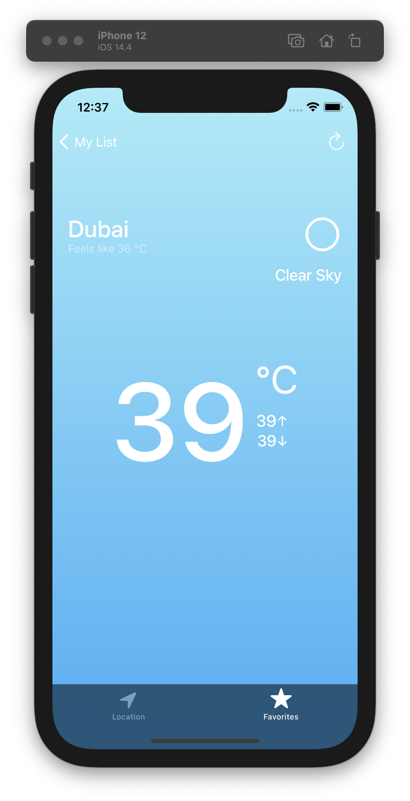

# WeatherApp

Weather App.

### Main Screen

## Features
* Frameworks: UIKit, Foundation,  CoreLocation, CoreData
* Using the MVC architecture
* Work with Api
* Designing an interface using Storyboard and code 
* Animations

### Background color, depending on the weather condition

## Weather API
* [OpenWeather](https://openweathermap.org) - Weather API

## Contact Info
* [Linkedin](https://www.linkedin.com/in/radetsky) 

yura.radetsky@gmail.com

